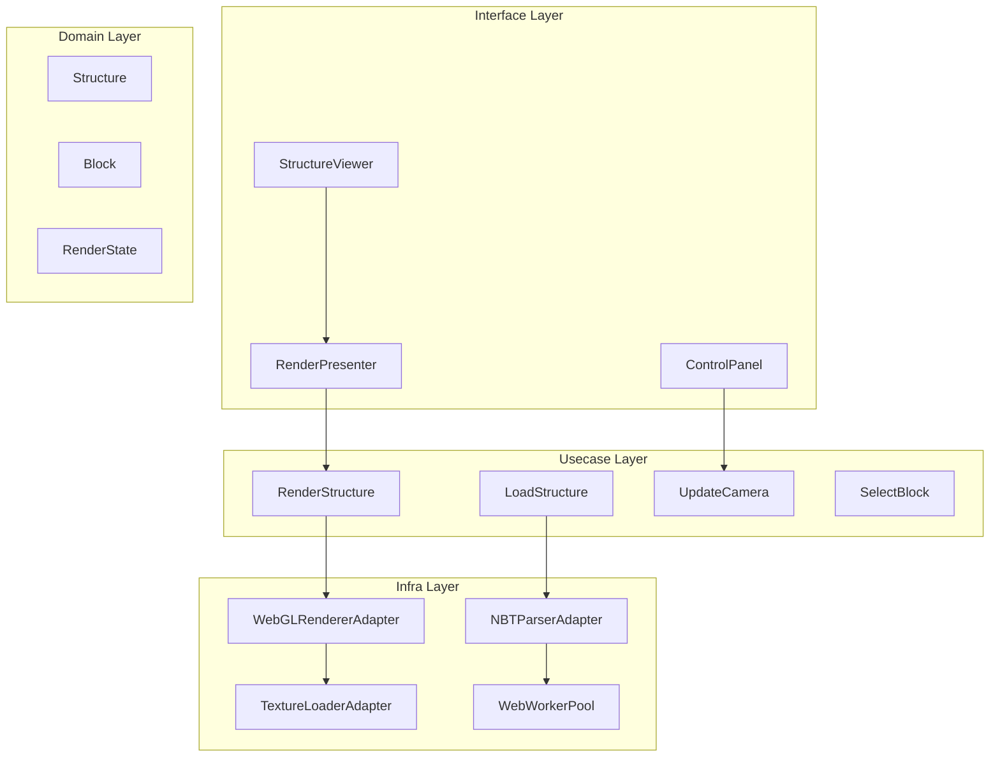
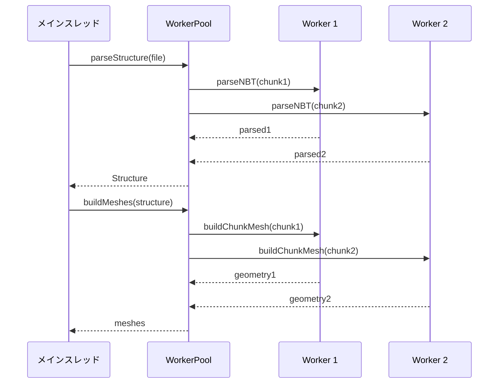
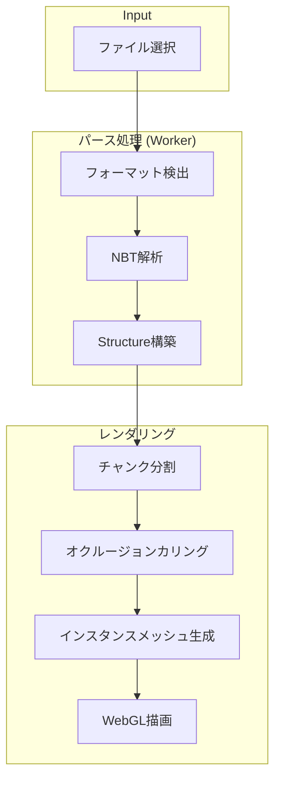
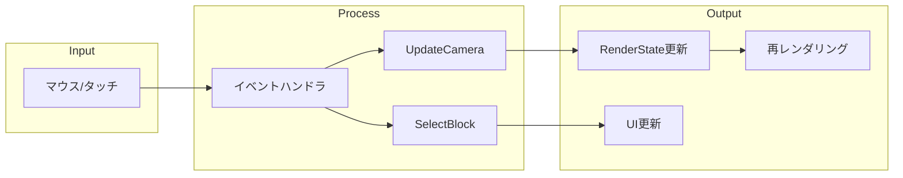

# 3D Structure Renderer アーキテクチャ設計

## 概要

### 目的
Minecraft建築データ（.schematic, .schem, .litematic, .mcstructure形式）をブラウザ上で3D表示するためのレンダラー設計。

### 性能要件
- スマートフォンで200x200x200ブロックを30fps以上で表示
- 初期ロード時間: 5秒以内
- メモリ使用量: 500MB以下

### 技術選定
- **Three.js**: WebGLレンダリングエンジン
- **prismarine-nbt**: NBT形式パーサー
- **Web Workers**: 非同期パース処理

---

## レイヤー設計



---

## Domain Layer

### エンティティ

#### Block
```typescript
interface Block {
  readonly id: BlockId;
  readonly position: Position;
  readonly state: BlockState;
  readonly lightLevel: number; // 0-15
}
```

#### Structure
```typescript
interface Structure {
  readonly id: StructureId;
  readonly name: string;
  readonly dimensions: Dimensions;
  readonly palette: readonly BlockState[];
  readonly blocks: ReadonlyMap<string, Block>; // key: "x,y,z"
  readonly metadata: StructureMetadata;
}
```

#### RenderState
```typescript
interface RenderState {
  readonly camera: Camera;
  readonly lodLevel: LodLevel;
  readonly selectedBlock: Position | null;
  readonly visibleChunks: readonly ChunkCoord[];
  readonly quality: RenderQuality;
}
```

### 値オブジェクト

#### Position
```typescript
interface Position {
  readonly x: number;
  readonly y: number;
  readonly z: number;
}
```

#### BlockState
```typescript
interface BlockState {
  readonly name: string;           // e.g., "minecraft:stone"
  readonly properties: Readonly<Record<string, string>>;
}
```

#### Camera
```typescript
interface Camera {
  readonly position: Position;
  readonly target: Position;
  readonly zoom: number;
  readonly rotation: { pitch: number; yaw: number };
}
```

#### Dimensions
```typescript
interface Dimensions {
  readonly width: number;   // X軸
  readonly height: number;  // Y軸
  readonly depth: number;   // Z軸
}
```

#### LodLevel
```typescript
type LodLevel = 0 | 1 | 2 | 3;
// 0: フル詳細
// 1: 2x2x2ブロックを1つに
// 2: 4x4x4ブロックを1つに
// 3: 8x8x8ブロックを1つに
```

#### RenderQuality
```typescript
interface RenderQuality {
  readonly shadows: boolean;
  readonly ambientOcclusion: boolean;
  readonly antialiasing: boolean;
  readonly maxDrawDistance: number;
}
```

---

## Usecase Layer

### ユースケース

#### LoadStructure
```typescript
interface LoadStructureInput {
  readonly file: File | ArrayBuffer;
  readonly format: StructureFormat;
}

interface LoadStructureOutput {
  readonly structure: Structure;
  readonly parseTime: number;
}

interface LoadStructureUsecase {
  execute(input: LoadStructureInput): Promise<Result<LoadStructureOutput, PortError>>;
}
```

#### RenderStructure
```typescript
interface RenderStructureInput {
  readonly structure: Structure;
  readonly state: RenderState;
  readonly canvas: HTMLCanvasElement;
}

interface RenderStructureUsecase {
  execute(input: RenderStructureInput): Promise<Result<void, PortError>>;
  dispose(): void;
}
```

#### UpdateCamera
```typescript
interface UpdateCameraInput {
  readonly action: CameraAction;
  readonly delta?: number;
}

type CameraAction =
  | { type: 'rotate'; pitch: number; yaw: number }
  | { type: 'zoom'; delta: number }
  | { type: 'pan'; x: number; y: number }
  | { type: 'reset' };

interface UpdateCameraUsecase {
  execute(input: UpdateCameraInput): RenderState;
}
```

#### SelectBlock
```typescript
interface SelectBlockInput {
  readonly screenX: number;
  readonly screenY: number;
  readonly structure: Structure;
}

interface SelectBlockOutput {
  readonly block: Block | null;
  readonly face: BlockFace | null;
}

interface SelectBlockUsecase {
  execute(input: SelectBlockInput): SelectBlockOutput;
}
```

### Port定義

#### NBTParserPort
```typescript
interface NBTParserPort {
  parse(data: ArrayBuffer, format: StructureFormat): Promise<Result<ParsedNBT, PortError>>;
  toStructure(nbt: ParsedNBT): Result<Structure, PortError>;
}
```

#### WebGLRendererPort
```typescript
interface WebGLRendererPort {
  initialize(canvas: HTMLCanvasElement, options: RendererOptions): Promise<Result<void, PortError>>;
  render(structure: Structure, state: RenderState): void;
  raycast(screenX: number, screenY: number): RaycastResult | null;
  dispose(): void;
}
```

#### TextureLoaderPort
```typescript
interface TextureLoaderPort {
  loadDefaultTextures(): Promise<Result<TextureAtlas, PortError>>;
  loadResourcePack(pack: ArrayBuffer): Promise<Result<TextureAtlas, PortError>>;
  getBlockTexture(blockState: BlockState): BlockTextures;
}
```

#### RenderCachePort
```typescript
interface RenderCachePort {
  getChunkMesh(chunkCoord: ChunkCoord): ChunkMesh | null;
  setChunkMesh(chunkCoord: ChunkCoord, mesh: ChunkMesh): void;
  invalidate(chunkCoords?: readonly ChunkCoord[]): void;
  clear(): void;
}
```

---

## Interface Layer

### Reactコンポーネント

#### StructureViewer
```typescript
interface StructureViewerProps {
  structureId: string;
  quality?: RenderQuality;
  onBlockSelect?: (block: Block | null) => void;
  onLoadProgress?: (progress: number) => void;
  onError?: (error: Error) => void;
}
```

メインの3Dビューワーコンポーネント。

#### ControlPanel
```typescript
interface ControlPanelProps {
  onQualityChange: (quality: RenderQuality) => void;
  onReset: () => void;
  currentQuality: RenderQuality;
}
```

品質設定やリセットボタンを提供。

#### LoadingIndicator
```typescript
interface LoadingIndicatorProps {
  progress: number; // 0-100
  message: string;
}
```

ロード状態を表示。

### Presenter

#### RenderPresenter
```typescript
interface RenderViewModel {
  readonly isLoading: boolean;
  readonly progress: number;
  readonly error: string | null;
  readonly blockInfo: BlockInfoViewModel | null;
  readonly stats: RenderStatsViewModel;
}

interface BlockInfoViewModel {
  readonly name: string;
  readonly displayName: string;
  readonly position: string; // "X: 10, Y: 20, Z: 30"
  readonly properties: readonly { key: string; value: string }[];
}

interface RenderStatsViewModel {
  readonly fps: number;
  readonly drawCalls: number;
  readonly triangles: string; // "1.2M"
  readonly memory: string;    // "256 MB"
}

class RenderPresenter {
  toViewModel(state: RenderState, structure: Structure | null): RenderViewModel;
  formatBlockName(state: BlockState): string;
  formatPosition(pos: Position): string;
}
```

---

## Infra Layer

### アダプター実装

#### NBTParserAdapter
```typescript
class NBTParserAdapter implements NBTParserPort {
  private worker: Worker;

  async parse(data: ArrayBuffer, format: StructureFormat): Promise<Result<ParsedNBT, PortError>> {
    // Web Workerでパース処理を実行
    return this.worker.postMessage({ type: 'parse', data, format });
  }

  toStructure(nbt: ParsedNBT): Result<Structure, PortError> {
    // フォーマット別の変換ロジック
    switch (nbt.format) {
      case 'schematic': return this.fromSchematic(nbt);
      case 'schem': return this.fromSponge(nbt);
      case 'litematic': return this.fromLitematic(nbt);
      case 'mcstructure': return this.fromBedrock(nbt);
    }
  }
}
```

#### WebGLRendererAdapter
```typescript
class WebGLRendererAdapter implements WebGLRendererPort {
  private scene: THREE.Scene;
  private camera: THREE.PerspectiveCamera;
  private renderer: THREE.WebGLRenderer;
  private controls: OrbitControls;
  private chunkMeshes: Map<string, THREE.InstancedMesh>;

  async initialize(canvas: HTMLCanvasElement, options: RendererOptions): Promise<Result<void, PortError>> {
    this.renderer = new THREE.WebGLRenderer({
      canvas,
      antialias: options.antialiasing,
      powerPreference: 'high-performance'
    });
    // セットアップ処理
  }

  render(structure: Structure, state: RenderState): void {
    this.updateCamera(state.camera);
    this.updateVisibleChunks(state.visibleChunks);
    this.renderer.render(this.scene, this.camera);
  }
}
```

#### TextureLoaderAdapter
```typescript
class TextureLoaderAdapter implements TextureLoaderPort {
  private atlas: THREE.Texture | null = null;
  private blockTextureMap: Map<string, UVCoordinates>;

  async loadDefaultTextures(): Promise<Result<TextureAtlas, PortError>> {
    // デフォルトテクスチャアトラスのロード
    const image = await this.loadImage('/textures/blocks.png');
    this.atlas = new THREE.Texture(image);
    return ok({ texture: this.atlas, uvMap: this.blockTextureMap });
  }
}
```

#### WebWorkerPool
```typescript
class WebWorkerPool {
  private workers: Worker[];
  private taskQueue: Task[];
  private busyWorkers: Set<Worker>;

  constructor(size: number = navigator.hardwareConcurrency || 4) {
    this.workers = Array.from({ length: size },
      () => new Worker(new URL('./nbt-worker.js', import.meta.url))
    );
  }

  async execute<T>(task: WorkerTask): Promise<T> {
    const worker = await this.getAvailableWorker();
    return this.runOnWorker(worker, task);
  }
}
```

---

## パフォーマンス最適化

### インスタンスレンダリング

同一ブロックタイプを単一のDraw Callでレンダリング:

```typescript
// 1つのブロックタイプにつき1つのInstancedMesh
const mesh = new THREE.InstancedMesh(geometry, material, blockCount);

// 各インスタンスの位置を設定
blocks.forEach((block, index) => {
  matrix.setPosition(block.position.x, block.position.y, block.position.z);
  mesh.setMatrixAt(index, matrix);
});
```

効果: Draw Callを90%以上削減

### オクルージョンカリング

隠れた面を描画しない:

```typescript
function shouldRenderFace(structure: Structure, pos: Position, face: BlockFace): boolean {
  const neighborPos = getNeighborPosition(pos, face);
  const neighbor = structure.blocks.get(positionKey(neighborPos));

  // 隣接ブロックが不透明なら面を描画しない
  return !neighbor || !isOpaqueBlock(neighbor.state);
}
```

効果: 頂点数を60-80%削減

### Level of Detail (LOD)

距離に応じて詳細度を変更:

```typescript
function getLodLevel(distance: number): LodLevel {
  if (distance < 50) return 0;   // フル詳細
  if (distance < 100) return 1;  // 2x2x2
  if (distance < 200) return 2;  // 4x4x4
  return 3;                       // 8x8x8
}
```

### チャンクベースレンダリング

16x16x16ブロック単位で管理:

```typescript
interface Chunk {
  readonly coord: ChunkCoord;
  readonly blocks: ReadonlyMap<string, Block>;
  mesh: THREE.InstancedMesh | null;
  isDirty: boolean;
}

function updateVisibleChunks(camera: Camera, chunks: Map<string, Chunk>): void {
  const visibleCoords = getFrustumChunks(camera);

  for (const coord of visibleCoords) {
    const chunk = chunks.get(chunkKey(coord));
    if (chunk?.isDirty) {
      rebuildChunkMesh(chunk);
    }
  }
}
```

### Web Workers活用

メインスレッドをブロックしない:



---

## データフロー

### ファイルロードからレンダリングまで



### ユーザーインタラクション



---

## 実装フェーズ

### Phase 1: 基本機能（2週間）

**目標**: 単一フォーマットのパースと基本レンダリング

- [ ] Domain: Block, Structure, Position 値オブジェクト
- [ ] Usecase: LoadStructure, RenderStructure
- [ ] Infra: NBTParserAdapter (.schematic対応)
- [ ] Infra: WebGLRendererAdapter (基本レンダリング)
- [ ] Interface: StructureViewer (最小構成)

**完了条件**: .schematicファイルを読み込み、3D表示できる

### Phase 2: パフォーマンス最適化（2週間）

**目標**: 大規模構造物のスムーズな表示

- [ ] Infra: インスタンスレンダリング実装
- [ ] Infra: オクルージョンカリング実装
- [ ] Infra: チャンクベースレンダリング
- [ ] Infra: Web Workers統合
- [ ] Infra: RenderCachePort実装

**完了条件**: 200x200x200ブロックが30fps以上

### Phase 3: インタラクティブ機能（1週間）

**目標**: ユーザー操作の充実

- [ ] Usecase: UpdateCamera
- [ ] Usecase: SelectBlock
- [ ] Interface: ControlPanel
- [ ] Interface: ブロック情報表示
- [ ] Infra: Raycast実装

**完了条件**: カメラ操作とブロック選択が動作

### Phase 4: 高度なレンダリング（2週間）

**目標**: 視覚品質の向上

- [ ] Domain: LodLevel, RenderQuality
- [ ] Infra: LOD実装
- [ ] Infra: 他フォーマット対応 (.schem, .litematic, .mcstructure)
- [ ] Infra: テクスチャアトラス
- [ ] Infra: アンビエントオクルージョン

**完了条件**: 全フォーマット対応、視覚品質オプション動作

---

## ADR（アーキテクチャ決定記録）

### ADR-001: Three.js採用

**ステータス**: 採用

**コンテキスト**: WebGL描画エンジンの選択

**決定**: Three.jsを採用

**理由**:
- 豊富なドキュメントとコミュニティ
- インスタンスレンダリングのネイティブサポート
- OrbitControlsなど便利なヘルパー
- 安定したAPI

**代替案**:
- Babylon.js: より重量級、オーバースペック
- 生WebGL: 開発コストが高い
- @enginehub/schematicwebviewer: 柔軟性に欠ける

### ADR-002: Web Workers活用

**ステータス**: 採用

**コンテキスト**: 大規模データのパース時のUI凍結防止

**決定**: NBTパースとメッシュ生成をWeb Workersで実行

**理由**:
- メインスレッドをブロックしない
- 複数コアの活用
- ユーザー体験の向上

**トレードオフ**:
- 実装複雑性の増加
- データ転送のオーバーヘッド

### ADR-003: チャンクベースレンダリング

**ステータス**: 採用

**コンテキスト**: 大規模構造物のメモリ管理

**決定**: 16x16x16ブロック単位でメッシュを管理

**理由**:
- 部分的な更新が可能
- メモリ使用量の制御
- フラスタムカリングの効率化
- Minecraftと同じサイズで親和性が高い

---

## 依存関係

```
three: ^0.160.0
prismarine-nbt: ^2.5.0
@types/three: ^0.160.0
```

---

## 関連ドキュメント

- [ドメイン層設計](../layers/domain/DESIGN.md)
- [ユースケース層設計](../layers/usecase/DESIGN.md)
- [インターフェース層設計](../layers/interface/DESIGN.md)
- [インフラ層設計](../layers/infra/DESIGN.md)
- [API契約](../contracts/api.md)
- [ポート契約](../contracts/ports.md)
