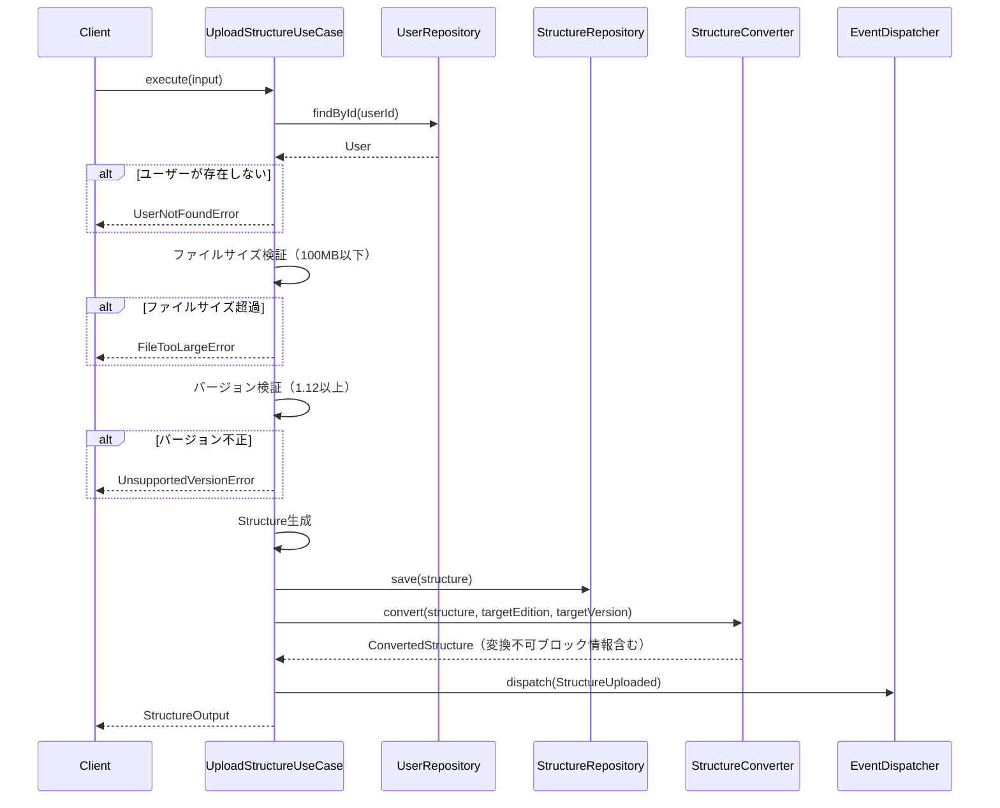
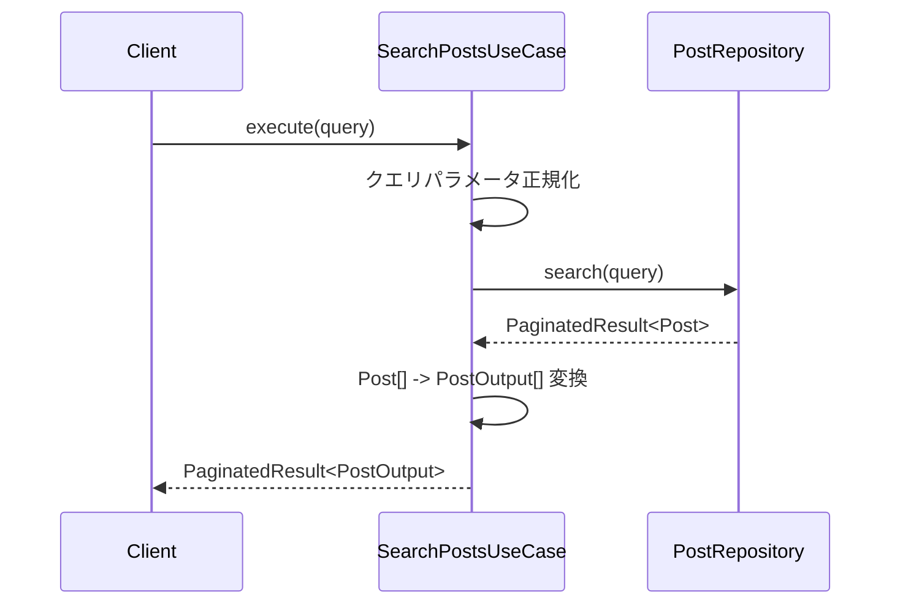
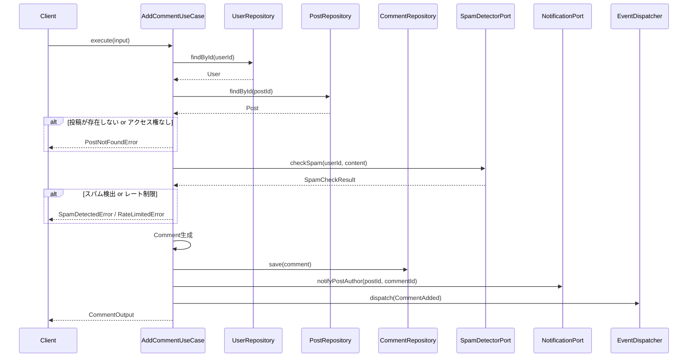
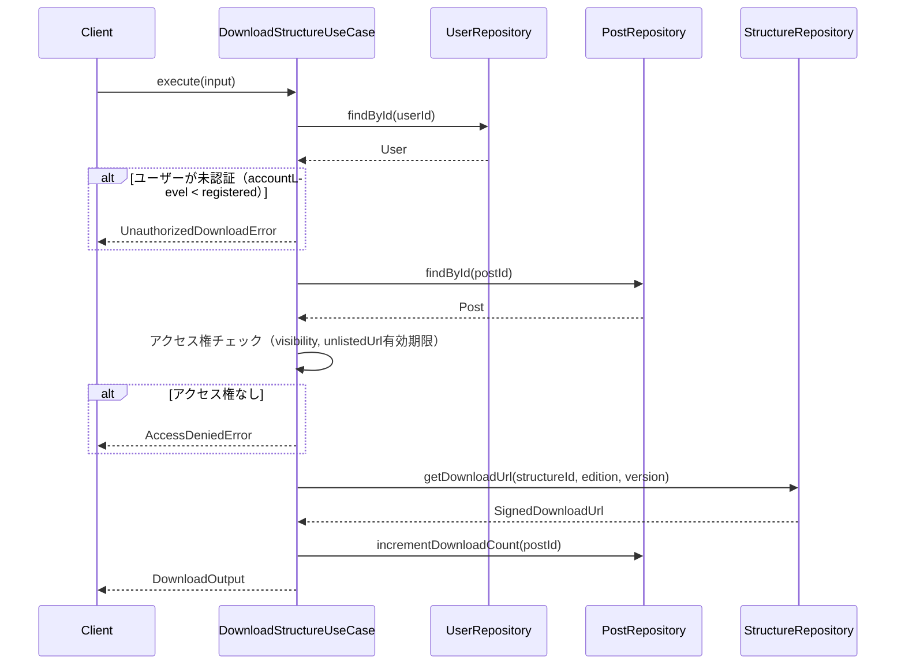

# Usecase レイヤ - 設計ドキュメント

## ユースケース一覧

| ユースケース名 | 説明 | 入力DTO | 出力DTO | 依存Port |
|---------------|------|---------|---------|----------|
| UploadStructure | 建築データアップロード＋自動変換 | UploadStructureInput | StructureOutput | StructureRepositoryPort, StructureConverterPort |
| CreatePost | 投稿作成 | CreatePostInput | PostOutput | PostRepositoryPort, StructureRepositoryPort |
| UpdatePost | 投稿編集 | UpdatePostInput | PostOutput | PostRepositoryPort |
| DeletePost | 投稿削除 | DeletePostInput | void | PostRepositoryPort, StructureRepositoryPort |
| SearchPosts | 投稿検索 | PostQuery | PaginatedResult<PostOutput> | PostRepositoryPort |
| GetPostDetail | 投稿詳細取得 | GetPostDetailInput | PostOutput | PostRepositoryPort |
| DownloadStructure | 建築データダウンロード | DownloadStructureInput | DownloadOutput | StructureRepositoryPort, PostRepositoryPort |
| RegisterUser | ユーザー登録 | RegisterUserInput | UserOutput | UserRepositoryPort, EmailPort |
| VerifyEmail | メール認証 | VerifyEmailInput | UserOutput | UserRepositoryPort |
| VerifyPhone | 電話認証 | VerifyPhoneInput | UserOutput | UserRepositoryPort, SmsPort |
| LikePost | いいね | LikePostInput | void | PostRepositoryPort, NotificationPort |
| UnlikePost | いいね取消 | UnlikePostInput | void | PostRepositoryPort |
| AddComment | コメント追加 | AddCommentInput | CommentOutput | CommentRepositoryPort, SpamDetectorPort, NotificationPort |
| DeleteComment | コメント削除 | DeleteCommentInput | void | CommentRepositoryPort |
| FollowUser | フォロー | FollowUserInput | void | UserRepositoryPort, NotificationPort |
| UnfollowUser | フォロー解除 | UnfollowUserInput | void | UserRepositoryPort |
| ReportContent | 通報 | ReportContentInput | void | ReportRepositoryPort |
| GetRenderData | レンダリングデータ取得 | GetRenderDataInput | RenderDataOutput | StructureRepositoryPort, RendererDataPort |
| ApplyResourcePack | リソパ適用 | ApplyResourcePackInput | RenderDataOutput | RendererDataPort |
| GetNotifications | 通知一覧取得 | GetNotificationsInput | PaginatedResult<NotificationOutput> | NotificationRepositoryPort |
| MarkNotificationRead | 通知既読 | MarkNotificationReadInput | void | NotificationRepositoryPort |

## シーケンス図

### UploadStructure ユースケース



### SearchPosts ユースケース



### AddComment ユースケース



### DownloadStructure ユースケース



## Port（インターフェース）定義

→ `docs/contracts/ports.md` を参照

## エラーハンドリング方針

### エラー分類

| エラー種別 | 説明 | HTTPステータス相当 | 例 |
|-----------|------|-------------------|-----|
| NotFoundError | リソースが見つからない | 404 | UserNotFoundError, PostNotFoundError |
| ValidationError | 入力値が不正 | 400 | FileTooLargeError, UnsupportedVersionError |
| UnauthorizedError | 認証が必要 | 401 | UnauthorizedDownloadError |
| ForbiddenError | 権限がない | 403 | AccessDeniedError |
| ConflictError | 状態の競合 | 409 | AlreadyLikedError |
| RateLimitedError | レート制限 | 429 | RateLimitedError |
| ExternalServiceError | 外部サービス障害 | 502/503 | ConverterError |

### エラー定義

```typescript
abstract class UseCaseError extends Error {
  abstract readonly code: string
  abstract readonly statusCode: number
}

class FileTooLargeError extends UseCaseError {
  readonly code = 'FILE_TOO_LARGE'
  readonly statusCode = 400

  constructor(maxSize: number, actualSize: number) {
    super(`ファイルサイズが上限（${maxSize}MB）を超えています: ${actualSize}MB`)
  }
}

class UnsupportedVersionError extends UseCaseError {
  readonly code = 'UNSUPPORTED_VERSION'
  readonly statusCode = 400

  constructor(version: string) {
    super(`1.12以上のバージョンを指定してください: ${version}`)
  }
}

class UnauthorizedDownloadError extends UseCaseError {
  readonly code = 'UNAUTHORIZED_DOWNLOAD'
  readonly statusCode = 401

  constructor() {
    super('ダウンロードにはメール認証が必要です')
  }
}

class SpamDetectedError extends UseCaseError {
  readonly code = 'INAPPROPRIATE_CONTENT'
  readonly statusCode = 400

  constructor() {
    super('このコメントは投稿できません')
  }
}

class RateLimitedError extends UseCaseError {
  readonly code = 'RATE_LIMITED'
  readonly statusCode = 429

  constructor() {
    super('投稿間隔が短すぎます。しばらくお待ちください')
  }
}
```

### Result型パターン

```typescript
type Result<T, E> = { success: true; data: T } | { success: false; error: E }

class UploadStructureUseCase {
  async execute(input: UploadStructureInput): Promise<Result<StructureOutput, UseCaseError>> {
    // ...
  }
}
```

## トランザクション境界

- ユースケース単位でトランザクションを管理
- 複数リポジトリへの書き込みは単一トランザクション内で実行
- トランザクション管理はInfrastructure層に委譲（UnitOfWorkパターン）

## 備考

- 本ドキュメントは Minecraft建築データ共有SNS の Usecase レイヤ設計を定義
- 新規ユースケース追加時はシーケンス図も作成すること
- Port定義は `docs/contracts/ports.md` を Single Source of Truth とする
